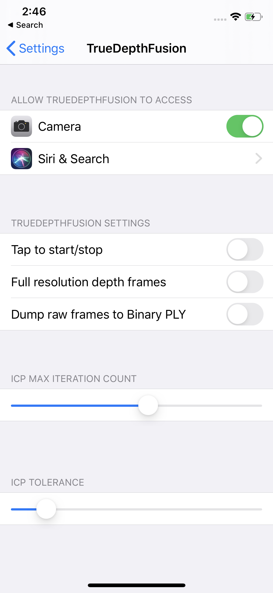

# TrueDepthFusion

Our internal testing app, that we use for testing and running the reconstruction algorithm in the framework `StandardCyborgFusion` in iOS, on the phone. 

## How to mesh a pointcloud

After completing a scan, press "Done", and then click on the image in the bottom left corner. Then click "Mesh", in the top left corner. 

## How to export a trace. 

### Protobags

The `TrueDepthFusion` app records protobags to disk.  Simply connect your device via USB to your Mac and use the file
browser to find the zipfiles in the `TruthDepthFusion`'s files.  

### Binary PLYs

For developing and improving our reconstruction algorithm, it is often useful to just record a sequence of a frames 
captured by the device, and then save them onto your computer. 

To do this, first enable "Dump raw frame to binary ply, in the app settings"

Then open the TrueDepthFusion app, and scan like normal, to start capturing a trace. After you're done,
you can simply airdrop the trace onto your computer. 

You can feed this trace into `VisualTesterMac`, in order to reconstruct a point cloud from this trace. 

